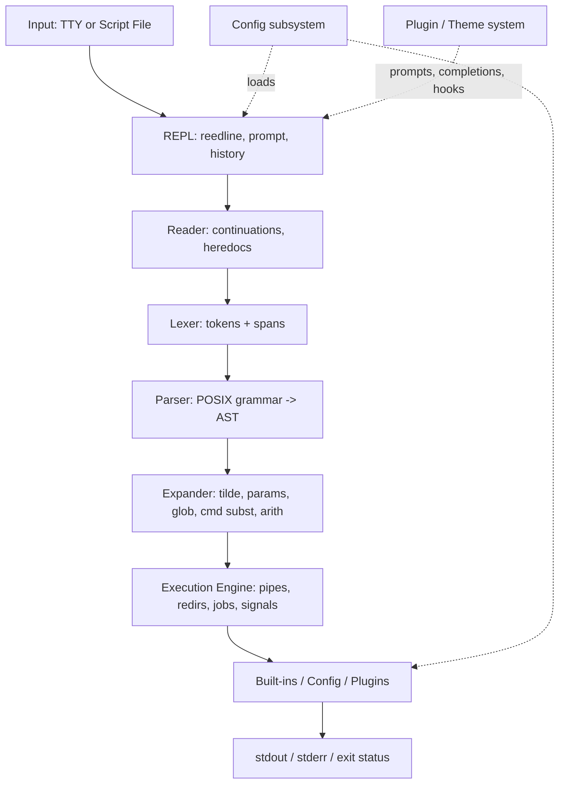

# Technical Plan: Building `bsh` — A Memory-Safe, Crash-Resistant, Cross-Platform Shell in Rust

> **Project Name:** `bsh` (Bourne Shell-inspired, Rust-based)
> **Scope:** Memory-safe, POSIX-compliant script execution with modern interactive UX (Zsh-like customization + Fish-like defaults), Unix-first, Windows/DOS secondary.
> **Audience:** Senior Rust engineers.
> **Status:** Implementation-ready plan.

---

## 1. Architecture Overview

`bsh` is decomposed into modular, testable crates enforcing separation of concerns and
cross-platform isolation. The architecture is designed for deterministic behavior in
batch mode and low-latency interactivity in REPL mode.

```text
+-------------------------------+  Input Sources
|  TTY (stdin) / Script File  |  (interactive vs batch)
+---------------+-------------+
                v
+---------------+-------------+  Line Editing / Keybindings
|  REPL (reedline + Prompt)  |  (history, autosuggest, hints)
+---------------+-------------+
                v
+---------------+-------------+  Input Normalization
|          Reader            |  (continuations, heredocs, backslash-newline)
+---------------+-------------+
                v
+---------------+-------------+  Lexical Analysis
|            Lexer           |  (tokens, positions, source spans)
+---------------+-------------+
                v
+---------------+-------------+  Syntactic Analysis
|           Parser           |  (POSIX shell grammar -> AST)
+---------------+-------------+
                v
+---------------+-------------+  Semantic Prep / Expansion
|         Expander           |  (tilde, params, brace, glob, cmd subst, arithmetic, quoting)
+---------------+-------------+
                v
+---------------+-------------+  Execution
|     Execution Engine       |  (AST eval: pipes, redirs, lists, subshells, jobs)
+---------------+-------------+
                v
+---------------+-------------+  Built-ins / Plugins / Config
|  Built-ins | Plugins | CFG |  (cd, export, source, theme, aliases)
+---------------+-------------+
                v
+-------------------------------+  Stdout/Stderr/Exit Status
```

Mermaid equivalent:



### 1.1 Component Responsibilities

| Component | Responsibility | Key Design Notes |
|---|---|---|
| **REPL Loop** | Interactive prompt, line editing, keymaps, autosuggestions, syntax highlighting overlays, history search (Ctrl+R). | Uses `reedline` with custom `Highlighter`, `Completer`, `History` backends. Handles job suspension (SIGTSTP), EOF, `Ctrl+C/D/Z`. |
| **Reader** | Preprocesses input before lexing: line continuations (`\`), here-documents (`<<`, `<<-`), here-strings if added, script concatenation. | Must preserve source spans for diagnostics. Tracks `PS1/PS2` context. Critical for POSIX conformance. |
| **Lexer** | Tokenizes shell metacharacters (`\| & ; < > ( ) { } $ # ' " \``), words, operators, IO numbers, comments. | Whitespace/quoting-aware. Emits `(TokenKind, Span)`. Zero allocations in hot paths where feasible. |
| **Parser** | Converts token stream to AST per POSIX shell grammar (simple commands, pipelines, lists `&& \|\| ;`, compound commands `if/while/for/case`, function definitions, redirections). | Supports both **batch** (strict POSIX mode) and **interactive** (extensions guarded by config). Error recovery minimal but diagnostics actionable. |
| **AST** | Strongly-typed, immutable IR representing commands/expressions. | `enum`-based with `Box`/`Arc` only where necessary. Source spans embedded for error reporting. |
| **Expander** | Shell expansions in POSIX order: brace, tilde, parameter/variable, command substitution, arithmetic, field splitting, pathname globbing, quote removal. | Expansion is context-sensitive (double quotes suppress splitting/globbing except `$`). Side-effect-aware (command substitution spawns subshells). |
| **Execution Engine** | Evaluates AST: forks/subshells, pipelines, FD redirection, process groups, job control, signal propagation, exit statuses (`$?`). | Core of crash-resistance: isolates failures per command, preserves shell state on external command failure. Uses platform abstractions. |
| **Built-ins** | POSIX built-ins (`cd, echo, exit, export, set, unset, shift, source/. , read, test/[ , pwd, jobs, bg, fg, wait, kill, alias, unalias, type, command, umask, times, trap`) plus QoL (`history, theme, plugin`). | Implemented in Rust, invoked without spawning processes. Same behavior across platforms where semantics overlap. |
| **Configuration Subsystem** | Loads `~/.bshrc`, `$XDG_CONFIG_HOME/bsh/config.toml`, environment, themes, aliases, keybindings, completion sources. | Hierarchical: defaults < system < user < project-local. Hot-reload-safe (interactive). `serde` + TOML primary. |
| **Plugin/Theme System** | Extension points: prompt segments, completion providers, keymaps, hooks (pre-exec, post-exec, chpwd, on-error). | **Static linking** (compile-time plugins) first for safety/reproducibility; WASM sandboxed plugins explicitly deferred (risk-flagged). |
| **Completion Engine** | Fish-like smart tab completion: commands, paths, variables, built-ins, man-page hints, plugin-provided completions. | Context-aware (cursor position + token under cursor). Candidates ranked by history/frecency. |
| **History** | Searchable, deduplicated history with session merge, optional timestamps, secure file storage. | File-backed (`~/.bsh_history`), atomic writes, corruption-tolerant (skip malformed lines). |

---

## 2. Crate & Dependency Choices

| Dependency | Purpose | Rationale | Trade-offs | Notes |
|---|---|---|---|---|
| [`reedline`](https://crates.io/crates/reedline) | REPL line editor | Modern, extensible (custom prompts, highlighter, completer, hinter, hint menus). Crossterm backend. | Slightly heavier than minimal editors; API evolves. | **Preferred** over `rustyline` for Fish/Zsh-like UX (hints, multiline, menus). |
| [`crossterm`](https://crates.io/crates/crossterm) | Cross-platform TTY/ANSI | Zero external C deps; raw mode, cursor, colors, events; Unix + Windows. | Low-level; wrapped in terminal traits. | Foundation for syntax highlighting, autosuggest. |
| [`nix`](https://crates.io/crates/nix) | Unix syscalls | Safe ergonomic wrappers: `fork/exec`, `pipe`, `dup2`, `setsid`, `tcsetpgrp`, `sigaction`, `waitpid`, `fcntl`, `poll`, `pty`. | Unix-only; strictly `cfg(unix)`. | Critical for job control, signals, pipelines, subshells. |
| [`windows-sys`](https://crates.io/crates/windows-sys) | Windows syscalls | Lean official bindings: `CreateProcess`, Job Objects, console, pipes, ctrl events. | Platform-specific; must not leak past abstraction boundary. | Secondary target only. |
| Hand-written lexer (default) vs [`logos`](https://crates.io/crates/logos) | Lexing | Shell quoting is context-heavy (here-doc delimiter stack, `$'...'`, backtick nesting). Manual state machine = clearest span control. | `logos` faster to iterate for simple tokens; harder for mode/state transitions. | **Start hand-written**; revisit `logos` if perf bottleneck (unlikely for typical script sizes). |
| [`chumsky`](https://crates.io/crates/chumsky) or hand-written recursive descent | Parsing | Combinators give rich diagnostics + spans. Hand-written gives max control over shell ambiguities (here-docs mid-parse) and predictable compile times. | `chumsky` compile-time heavier. | **Start hand-written**, evaluate `chumsky`/`winnow` if diagnostics lag. |
| [`miette`](https://crates.io/crates/miette) + [`ariadne`](https://crates.io/crates/ariadne) | Diagnostics | Source-span-aware error reporting (labels, notes, color) for both batch and REPL. | Optional at MVP (simple `Display` first is acceptable). | Strongly recommended by Phase 2. |
| [`thiserror`](https://crates.io/crates/thiserror) | Error enums | Structured, non-panicking error types; derive-only, zero runtime cost. | — | Core to zero-panic strategy. |
| [`anyhow`](https://crates.io/crates/anyhow) | Dynamic errors | Convenient in tests/prototyping. | Hides error provenance if overused. | **Forbidden** in public engine APIs; allowed in `main`/tests only. |
| [`serde`](https://crates.io/crates/serde) + [`toml`](https://crates.io/crates/toml) | Config serialization | Robust schema evolution; TOML human-first (Zsh-like dotfiles). | TOML limited for deeply nested; JSON optional escape hatch. | Primary config format. |
| [`glob`](https://crates.io/crates/glob) | Pathname globbing | Cross-platform, POSIX-like `* ? []`. | Windows case-insensitivity nuances. | Wrap with `cfg` awareness; respect `nocaseglob/nullglob/failglob`. |
| [`shell-words`](https://crates.io/crates/shell-words) | Word splitting reference | Useful test oracle. | Not full shell semantics. | **Reference-only** in tests, never engine code. |
| [`tempfile`](https://crates.io/crates/tempfile) | Temp files (here-docs) | Secure, atomic, auto-cleanup, cross-platform. | Small dep. | Essential for crash-resistance. |
| [`dirs`](https://crates.io/crates/dirs) | XDG/home dirs | Correct cross-platform home/config paths. | Minimal. | Or `etcetera` for stricter XDG. |
| [`clap`](https://crates.io/crates/clap) | CLI flags (wrapper only) | `--version`, `-c`, `-i`, `--norc`, `--rcfile`, `--posix`. | Overkill if misused. | **Bootstrap only** — never inside engine parsing. |
| [`string-interner`](https://crates.io/crates/string-interner) / [`lasso`](https://crates.io/crates/lasso) | Identifier interning | Fast equality, dedup, smaller AST, no lifetime gymnastics across passes. | One global-ish table; needs care in tests. | Identifiers, var names, built-in names, aliases. |
| [`parking_lot`](https://crates.io/crates/parking_lot) | Sync primitives | Faster, poisoning-free mutexes. | Small dep. | Optional at MVP (read-mostly shared caches). |
| [`tokio`](https://crates.io/crates/tokio) | Async (optional) | REPL I/O, background completion fetchers, PTY watchers. | Runtime overhead if forced globally; async+fork is error-prone. | **Recommendation:** engine stays **synchronous/blocking** (fork/exec model). Tokio optional behind feature flag, isolated at REPL boundary only. |

**Justification summary:** `nix` + `crossterm` + `reedline` for POSIX + UX; hand-written lexer/parser for shell-specific complexity; `thiserror` + `miette` for structured safety; zero C deps preferred.

---

## 3. Cross-Platform Abstraction Strategy

Goal: isolate Unix-specific code (signals, job control, PTYs, fork/exec) while keeping
Windows/DOS paths viable and testable. Platform differences are **implementation
details** and must not leak into AST/expander.

### 3.1 Architectural Pattern

- **Trait-based platform layer** (`platform::Platform`): abstracts processes, files,
  signals, terminal, jobs, environment.
- **Feature-based split:** `#[cfg(unix)]`, `#[cfg(windows)]`. DOS noted as
  exploratory (Rust target support limited — see risks).
- **No platform-specific types across the engine boundary.** Return Rust-native types
  (`PathBuf`, `Pid`, `ExitStatus`, `io::Error` mapped to domain errors).
- **Capability detection:** gracefully degrade (job control, PTY, process groups) on
  unsupported platforms.

### 3.2 Trait Surface (sketch)

```rust
pub trait Platform: Send + Sync {
    type Proc: Process;
    type Sig: Signals;
    type Term: Terminal;
    type Fs: Filesystem;
    type Jobs: JobControl;

    fn processes(&self) -> &Self::Proc;
    fn signals(&self) -> &Self::Sig;
    fn terminal(&self) -> &Self::Term;
    fn fs(&self) -> &Self::Fs;
    fn jobs(&self) -> &Self::Jobs;
    fn env(&self) -> &EnvApi;
}

pub trait Process {
    fn spawn(&self, cmd: &CommandSpec) -> Result<ChildHandle>;
    fn exec_replace(&self, cmd: &CommandSpec) -> Result<Infallible>; // execvp family
    fn wait(&self, pid: Pid, opts: WaitOpts) -> Result<WaitResult>;
    fn kill_group(&self, pgid: Pgid, sig: Signal) -> Result<()>;
}

pub trait JobControl {
    fn set_foreground(&self, pgid: Pgid) -> Result<()>;
    fn set_background(&self, pgid: Pgid) -> Result<()>;
    fn tcsetpgrp(&self, fd: RawFd, pgid: Pgid) -> Result<()>;
    fn current_pgrp(&self) -> Pgid;
}

pub trait Signals {
    fn sigaction(&self, sig: Signal, act: SigAction) -> Result<SigAction>;
    fn block(&self, mask: SigSet) -> Result<SigSet>;
    fn restore(&self, mask: SigSet) -> Result<()>;
    fn raise(&self, sig: Signal) -> Result<()>;
}

pub trait Terminal {
    fn isatty(&self, fd: RawFd) -> bool;
    fn make_raw(&self, fd: RawFd) -> Result<TermiosState>;
    fn restore(&self, state: TermiosState) -> Result<()>;
    fn get_size(&self, fd: RawFd) -> Result<(u16, u16)>;
}
```

### 3.3 Platform Mapping

| Concern | Unix (`cfg(unix)`) | Windows (`cfg(windows)`) | Notes |
|---|---|---|---|
| Process model | `fork()` + `exec*()` for subshells; `posix_spawn` optional (perf). | `CreateProcessW`, Job Objects for groups. **No fork.** | Windows subshells spawn a fresh `bsh` process tree (no in-place heap copy). |
| Process groups / jobs | `setsid`, `setpgid`, `tcsetpgrp`; full POSIX job control. | `AssignProcessToJobObject`, `GenerateConsoleCtrlEvent`. | Full parity hard on Windows; **best-effort, experimental** until Phase 5+. |
| Signals | POSIX: `SIGINT, SIGTSTP, SIGQUIT, SIGCHLD, SIGTERM, SIGHUP, SIGWINCH`. | Console ctrl events + `SetConsoleCtrlHandler`; `SIGCHLD` emulated via wait handles. | Signal→exception mapping incomplete; guard accordingly. |
| Redirections / FDs | `dup2`, `fcntl`, `pipe2`. | `DuplicateHandle`, anonymous pipes, `CreateFileW`. | Preserve FD-number semantics where possible (POSIX `2>&1` must work). |
| PTYs | `posix_openpt`/`grantpt`/`unlockpt` + `forkpty`. | ConPTY (Win10+). | Feature-gated; fallback to pipes if unavailable. |
| Paths | `/`, case-sensitive, symlinks. | `\\`, case-insensitive, reparse points, long paths. | Glob, tilde, `cd` use `fs::canonicalize` carefully. |
| Environment | `environ`; byte-oriented. | `GetEnvironmentStringsW`/`SetEnvironmentVariableW`; UTF-16. | Avoid lossy conversions in script paths. |
| Tilde / home | `$HOME`. | `%USERPROFILE%` / `%HOME%` override. | `dirs` abstracts both. |

**Cross-compile strategy:** Unix is the primary CI target (Linux/macOS). Windows builds
in CI with features marked experimental until Phase 5. DOS: documented as exploratory
only (Rust tier-3/limited target coverage).

---

## 4. Bash Script Parsing vs. Interactive Shell Features

The shell must run POSIX-compliant scripts **identically** in batch mode while enabling
rich UX in interactive mode. Solution: **unified AST + mode-aware passes**, not two parsers.

### 4.1 Mode Definitions

| Mode | Trigger | Parser Behavior | Expander/Exec Behavior | Allowed Extensions |
|---|---|---|---|---|
| **Batch (POSIX)** | `bsh script.sh`, `bsh -c '...'`, stdin non-TTY, or `--posix`. | Strict POSIX grammar; reject non-POSIX constructs or treat per config. | No interactive prompts; job control disabled unless requested. | None by default. |
| **Interactive** | TTY stdin, `bsh -i`. | POSIX base + opt-in extensions (flag-gated). | Prompts, job control, `SIGINT` REPL recovery, history expansion (opt-in). | Autosuggest, highlighting, completion, aliases, themes. |
| **Restricted** | `bsh -r` | Subset: no `cd`, restricted `exec`, absolute-path redirs only, no external `source`. | Security-hardened. | All disabled. |

### 4.2 Unification Strategy

1. **Single grammar.** Parser produces the same AST node kinds for core constructs.
   Extensions are AST nodes behind feature flags (e.g. `ExtendedGlob`), validated at
   parse time by a `ModePolicy`.
2. **ModePolicy struct** passed to Lexer/Parser/Expander:

   ```rust
   #[derive(Clone, Copy, Debug, Default)]
   pub struct ModePolicy {
       pub strict_posix: bool,
       pub interactive:  bool,
       pub allow_extensions: bool,
   }
   impl ModePolicy {
       pub fn batch() -> Self { Self { strict_posix: true, interactive: false, allow_extensions: false } }
       pub fn interactive() -> Self { Self { strict_posix: false, interactive: true, allow_extensions: true } }
   }
   ```

3. **Lexer modes.** Maintain lexer state stack: normal, single-quoted, double-quoted,
   backtick/`$(...)`, here-doc delimiter, ANSI-C quoting (`$'...'`, extension).
   Here-docs require a **stack of states** (especially `<<-` tab stripping).
   Interactive mode does **not** relax quoting semantics (correctness-critical).
4. **Reader separation.** Interactive Reader handles `PS2` continuations and multiline
   hints; Batch Reader treats newline as token boundary unless escaped/continued
   per POSIX.
5. **Expansion parity.** Autosuggestions/highlighting are **read-only previews** — they
   never mutate execution state. Completion reuses Expander utilities with
   `split_fields=false`, `glob=false` where unsafe.
6. **Diagnostics split.** Interactive shows inline hints (reedline hinter); hard errors
   use the same span-based `miette` reports. Batch emits `file:line:col` to stderr.

### 4.3 Critical Compatibility Boundaries

| Feature | Batch (POSIX) | Interactive | Implementation Notes |
|---|---|---|---|
| Quoting (`' " \`) | Strict | Same | Non-negotiable. `$'...'` = extension behind flag. |
| Here-documents (`<<`, `<<-`) | Required | Same | Delimiter tracking across lines; `<<-` strips leading tabs only; quoted delimiter ⇒ no expansion; exact content preserved. |
| Command substitution `` `...` `` + `$(...)` | Required | Same | Nesting depth limit (default 128, configurable) to prevent stack/DoS. |
| Expansion order | POSIX-defined | Same | Deviations are bugs. |
| Pipelines / lists / subshells | Required | Same | Process-group semantics differ only for TTY foregrounding. |
| Job control (`jobs,bg,fg,kill %n`) | Disabled (undefined for scripts) | **Enabled by default** (Fish-like UX) | Guarded by `isatty` + policy. |
| Aliases | OFF in batch (POSIX default) | **ON** (Zsh/Fish-like) with `alias/unalias` | Interactive opt-in expansion, batch flag `--expand-aliases` if needed. Document clearly. |
| History expansion (`!`) | Never default | Opt-in via config | Dangerous in scripts; interactive opt-in with safety notes. |

**Design principle:** correctness first, richness second. Interactive features are
side-effect-free previews and cannot alter POSIX execution semantics.

---

## 5. Memory Safety & Zero-Panic Strategy

Goal: 100% Rust, memory-safe via safe abstractions, **zero-panic** in production engine
paths (REPL/exec/parser). Panics only for programmer invariants in `debug_assert!` or
justified `unreachable!()` — never on user input, malformed scripts, I/O errors, or OS
edge cases.

### 5.1 Core Principles

1. **No `unwrap()`/`expect()` in production code.** Allowed only in: `main` bootstrap
   (with logged fatal), tests, build scripts, and justified `unreachable!()` (comment
   required).
2. **Total error propagation.** All fallible ops return `Result<T, E>`; errors use
   `thiserror` with structured variants and source chains.
3. **Error taxonomy.** `ParseError`, `ExpandError`, `ExecError`, `IoError`,
   `ConfigError`, `BuiltInError` — user-facing ones implement `miette::Diagnostic`
   with spans.
4. **Resource safety (RAII).** FDs, pipes, PIDs, children, terminal states wrapped in
   `Drop` guards so `?`, early returns, and unwinding never leak or corrupt TTY state.
5. **Borrowing discipline.** AST/expander use `&str` + spans; identifiers interned.
   No `Arc<Mutex<...>>` in hot exec paths; mutable state isolated in `ExecContext`.
6. **Checked arithmetic.** Indices, limits (pipe counts, nesting depths) use checked/
   saturating ops; clamp DoS vectors (recursion depth, glob expansion count).
7. **Async boundaries.** If Tokio used, `catch_unwind` at thread boundary; core stays
   single-threaded sync.

### 5.2 Concrete Techniques

| Technique | Application | Rationale |
|---|---|---|
| `#[forbid(unsafe_code)]` | Engine crates (lexer, parser, AST, expander, exec logic, built-ins) | Enforce safe-Rust policy. |
| Confinement of `unsafe` | Only `platform/unix` and `platform/windows` crates, with `// SAFETY:` comment per block, unit tests, `cfg` boundary + safe trait wrappers | Syscalls require it; containment makes audit tractable. |
| `thiserror` enums | All subsystems | Exhaustive matches, structured context (span, path, PID). |
| `miette` diagnostics | User-facing script errors | Precise source locations; no stringly-typed messages. |
| RAII guards | `FdGuard`, `RawModeGuard` (termios), child reaps, process groups | Leak/TTY corruption prevention on error or panic. |
| String interner | Identifiers, variable names, built-in names | Dedup, fast equality, smaller AST. |
| Span tracking | Every token and AST node | Precise diagnostics without cloning source strings. |
| Depth limits | `$( )`, backticks, subshells `( )`, arithmetic `$(( ))`, here-doc expansion, glob recursion, alias expansion. Defaults: 128 (aliases: 1024). Configurable. | Prevents stack overflow + DoS; enforced at parse/expand time with `Result`. |
| Resource limits | Pipeline count, open FDs, word length, history size | Defense-in-depth; respect `ulimit` advisory where applicable. |
| Atomic writes | History, config, here-doc temps | Write temp + `fsync` + `rename` — crash-safe against partial writes. |
| Input validation | Paths, POSIX variable names, glob patterns | Typed errors early. |
| Fuzzing | Lexer, parser, expander, field splitting, glob, full pipeline | `cargo-fuzz` (libFuzzer) targets: arbitrary UTF-8, quoting edge cases, here-docs, nested substitutions. Nightly CI time-boxed. |
| Property testing | Quoting round-trips, expansion invariants, FD closure invariants, pipeline exit-status algebra | `proptest` for algebraic properties. |
| Model checking (exploratory) | Signal/FD race windows | `kani` for small state invariants (Phase 6 optional). |
| Sanitizers / MIRI | Fuzz targets (Linux nightly ASAN/UBSAN); MIRI on selected platform-crate tests | Runtime/interpreter-level safety nets. |
| Crash-resistance tests | SIGINT mid-REPL, SIGKILL mid-history-write, child death, SIGHUP | Assert shell stable, FDs closed, terminal restored, files intact. |
| No global mutable state in exec | Engine passes `&mut ExecContext` explicitly | Determinism, testability, no data races. |
| Lint enforcement | `#![deny(clippy::unwrap_used, clippy::expect_used)]` in engine crates; `#[allow]` requires justification comment | Machine-enforced zero-panic policy. |

### 5.3 Guardrail Examples

**RAII terminal restore:**
```rust
pub struct RawModeGuard {
    fd: RawFd,
    state: TermiosState,
    restored: bool,
}
impl Drop for RawModeGuard {
    fn drop(&mut self) {
        if !self.restored {
            let _ = self.terminal.restore(self.state); // best-effort on unwind
            self.restored = true;
        }
    }
}
```

**Invariant depth check:**
```rust
#[derive(Clone, Copy, Debug)]
pub struct NestingDepth(u32);
impl NestingDepth {
    pub fn inc(self, max: u32) -> Result<Self> {
        if self.0 >= max {
            Err(ExpandError::NestingTooDeep)
        } else {
            Ok(Self(self.0 + 1))
        }
    }
}
```

**Fuzz entrypoint (lexer):**
```rust
fuzz_target!(|data: &[u8]| {
    if let Ok(s) = std::str::from_utf8(data) {
        let _ = lex(s); // must never panic
    }
});
```

---

## 6. Step-by-Step Implementation Roadmap

Each phase ends with: tests passing, clippy+fmt green, smoke check, docs updated.

### Phase 0: Foundation & Scaffolding (1–2 weeks)

**Goal:** repo hygiene, crate layout, CI, error types, platform abstraction skeleton.

| Task | Details | Deliverables | Success Criteria |
|---|---|---|---|
| 0.1 Repo audit | Document existing `src/main.rs`, identify gaps vs plan. | `docs/ARCHITECTURE.md` draft | Clarity on baseline. |
| 0.2 Crate layout | Workspace: `bsh` (bin), `bsh-core` (lexer/parser/ast/expand/exec), `bsh-builtin`, `bsh-platform` (trait + unix/win), `bsh-config`, `bsh-complete`, `bsh-theme`, `bsh-plugin`, `bsh-repl`, `bsh-diagnostics`. | Cargo workspace + module tree | `cargo build --workspace` green. |
| 0.3 Tooling | rustfmt, clippy (deny warnings), just/Makefile, CI (build/test/clippy/fmt, nightly fuzz smoke). | CI config | CI green on scaffolds. |
| 0.4 Error types | Root `Error` via `thiserror`, `miette::Diagnostic` for user errors; `#[deny(clippy::unwrap_used, clippy::expect_used)]` in core. | Error enums per subsystem | Zero unwrap/expect in `bsh-core`. |
| 0.5 Platform traits | Skeleton `Platform`, `Process`, `Signals`, `Terminal`, `Filesystem`, `JobControl`; mock impl for tests. | Trait surface + cfg stubs | Mock-based unit tests compile/pass. |
| 0.6 CLI bootstrap | clap for `-c`, `-i`, `--norc`, `--rcfile`, `--posix`, `--version`. | CLI in bin only | REPL/script paths dispatch correctly. |

**Exit:** clean workspace, strict lints, error model established.

---

### Phase 1: Lexer + Reader + Basic REPL (2–3 weeks)

**Goal:** tokenization with correct quoting, source spans, minimal interactive loop.

| Task | Details | Deliverables | Success Criteria |
|---|---|---|---|
| 1.1 Reader | Line continuations, here-doc scanner (delimiter detection), `PS1/PS2`; preserve spans. | `bsh-core::reader` | Continuations + `<<` delimiter extraction unit-tested. |
| 1.2 Lexer | Tokens: WORD, ASSIGN, IO_NUMBER, OP (`\|\|\| & && ; ;; ( ) { } < > << >> <& >& \|&`), METACHAR, COMMENT, EOF. Quoting states: `'`, `"`, `\`, `$'...'` (ext). | `bsh-core::lexer` + `Span` | Golden tests: quotes, escapes, comments, here-doc tokens. No panic on arbitrary input. |
| 1.3 Spans + interner | `SourceId`, `Span`, interner for identifiers. | Core types | Diagnostics show correct line:col. |
| 1.4 Minimal REPL | reedline: `PS1` prompt, history file (atomic), Ctrl+C clears line, Ctrl+D exits, raw mode via crossterm. | `bsh-repl` | Loop runs; line editing + history work. |
| 1.5 Lexer fuzzing | `cargo-fuzz` target. | `fuzz/` | 10^6+ samples, no panic/UB. |
| 1.6 Smoke tests | POSIX token examples, quoting edge cases. | `tests/lexer/` | Deterministic snapshots. |

**Exit:** reliable tokenization + usable REPL skeleton.

---

### Phase 2: Parser + AST (3–4 weeks)

**Goal:** POSIX grammar → AST, diagnostics, mode policy.

| Task | Details | Deliverables | Success Criteria |
|---|---|---|---|
| 2.1 AST types | `Command::Simple`, `Pipeline`, `List`, `AndOr`, `Compound` (If/While/For/Case/Subshell/Brace), `Redir`, `Word`, `Assign`, `FuncDef`. | `bsh-core::ast` | `Debug` printable, spans preserved. |
| 2.2 Grammar (POSIX subset) | Recursive descent: simple commands + redirs, pipelines, lists, `&& \|\|`, `( )`, `{ }`, `if while for case`, `name() { }`, here-doc redirs. | `bsh-core::parser` | POSIX-style corpus passes. |
| 2.3 ModePolicy | Strict POSIX vs interactive extensions, flag enforcement. | Policy types | Batch rejects known non-POSIX in tests. |
| 2.4 Error recovery + diagnostics | miette labels (`expected '}'`, unterminated quote), notes; no panics on syntax errors. | Diagnostics integration | Actionable errors on 20+ common cases. |
| 2.5 Parser fuzzing | Token streams + raw strings. | `fuzz/parser` | No OOM/recursion blowup; depth limits enforced. |
| 2.6 AST snapshots | Golden AST for key constructs; invariant checks. | `tests/parser/` | Snapshots stable. |

**Exit:** parser produces correct AST for POSIX scripts + robust errors.

---

### Phase 3: Expander + Built-ins (3–4 weeks)

**Goal:** POSIX expansions in correct order, core built-ins, environment.

| Task | Details | Deliverables | Success Criteria |
|---|---|---|---|
| 3.1 Expansion framework | Pass order: brace → tilde → parameter → command substitution → arithmetic → field splitting → globbing → quote removal. `Expander<'a>` with `Env`, `ModePolicy`, `Depth`. | `bsh-core::expand` | Order matches POSIX tests; quoted fields never split/globbed. |
| 3.2 Tilde/params/glob | `~`, `~user`, `~+`, `~-`; POSIX parameter forms (`${VAR:-}`, `${#}`, `%`/`##` minimal); glob with `nocaseglob/nullglob/failglob` flags. | Expansion units | Tilde+params correct; glob respects quoting. |
| 3.3 Command substitution | Subshell capture via exec engine; backticks with escaping; depth limit; stderr passthrough policy. | Subshell capture | `$(echo $(date))` nested works. |
| 3.4 Arithmetic | Integer `$(( ))`, precedence, unary; div-by-zero → error (not panic); overflow → checked error. | `bsh-core::arith` | Correct precedence; typed errors. |
| 3.5 Field splitting + IFS | POSIX IFS: default S/T/NL; whitespace vs non-whitespace IFS; empty IFS disables splitting. | Splitter | Critical correctness table passes. |
| 3.6 Environment API | Layered env (global/exported/local), `set/unset/export/readonly`. Case-sensitivity documented per platform. | `bsh-core::env` | Export propagation to children correct. |
| 3.7 Built-ins (POSIX core) | `cd` (`-`, `CDPATH`, `PWD/OLDPWD`), `echo`, `exit`/`return`, `export/readonly/set/unset`, `shift`, `.`/`source`, `pwd`, `read` (IFS, `-r`), `test`/`[`, `command`, `type`, `alias/unalias`, `jobs/bg/fg/wait/kill`, `umask`, `times`, `trap`, `history`. | `bsh-builtin` | Exit statuses correct; no panics on bad args. |
| 3.8 Property tests | Quoting round-trips, expansion order invariants, field splitting tables. | `proptest` suite | Properties hold on randomized cases. |
| 3.9 Expander fuzzing | Word strings post-lex. | `fuzz/expand` | Depth/resource limits enforced. |

**Exit:** scripts with variables, expansions, built-ins evaluate correctly in batch mode.

---

### Phase 4: Execution Engine, Pipelines, Redirections, Job Control (4–5 weeks)

**Goal:** processes, pipes, FDs, subshells, signals, job control (Unix-first).

| Task | Details | Deliverables | Success Criteria |
|---|---|---|---|
| 4.1 Exec context | `ExecContext`: platform, env, cwd, jobs, traps, mode, exit status, foreground PGID. Mutable state isolated; testable with mock platform. | `bsh-core::exec` | Deterministic in-process tests. |
| 4.2 Simple commands | `execvp`/exec-replace for externals; built-ins dispatch without fork; `$PATH` search; `command -v`, `type`. | Simple exec path | `ls`, `/bin/echo`, built-ins correct. |
| 4.3 Redirections | `< > >> << <<- >& <& >\| <>`, IO numbers, FD duplication/clobber, here-doc temps (atomic, cleaned). Bad FD → non-zero exit, no panic. | Redir resolver | Quoted here-doc delimiter (no expansion); `<<-` strips tabs. |
| 4.4 Pipelines | `\|`, `\|&`, `2>&1 \|`; pipes, `dup2`, close ends, per-stage fork, process groups. POSIX status = last command (pipefail deferred, flag). | Pipeline executor | `echo hi \| wc -c`; long pipelines; exit propagation; **no FD leaks** (asserted). |
| 4.5 Lists | `&& \|\| ; &` short-circuit + background. | Control flow | Correct short-circuit semantics. |
| 4.6 Compound commands | `if/then/elif/else/fi`, `while`, `for` (word lists + `in`), `case/esac`, `until`, `{ ; }`, `( )`. | Compound exec | POSIX semantics; exit statuses propagate. |
| 4.7 Subshells | `( cmd )` in child: copied env, own process group, FDs restored on exit; no variable leakage back. | Subshell executor | Variable isolation verified. |
| 4.8 Functions | `name() { ... }`, invocation as simple command, dynamic scoping per POSIX, recursion depth limit. | Function table | Define + invoke + depth guard. |
| 4.9 Signals (Unix) | SIGINT: REPL clears line, scripts forward to FG group; SIGTSTP: suspend FG job; SIGCHLD: reap `WNOHANG` loop; SIGHUP: exit + notify jobs; SIGWINCH: resize. Signal mask block around fork/exec/setpgid critical section. | `bsh-platform::unix` + traps | No zombie/orphan races; tests with `kill` pass. |
| 4.10 Job control (Unix-first) | Process groups, controlling TTY `tcsetpgrp`, job table (`%1`, `+ -`), `jobs`, `bg`, `fg`, `wait`, `kill %n`; orphaned group SIGHUP policy. | `Jobs` + `JobControl` | Ctrl+Z, `fg/bg`, `sleep 10 &` all work. |
| 4.11 FD leak detection | Track test-harness FDs; assert pipe ends closed. | Test harness | Zero leaks in integration tests (`/proc/self/fd` on Linux). |
| 4.12 Batch integration tests | Pipelines, redirs, here-docs, subshells, `&& \|\|`, exit codes. | `tests/scripts/` + runner | POSIX-focused corpus passes. |
| 4.13 Windows stubs | `cfg(windows)` process spawn + console events skeleton. | `bsh-platform::windows` | Compiles; basic `-c` external commands (hardened Phase 5/6). |

**Exit:** core engine functional for Unix batch + interactive jobs; terminal restored on
SIGINT/errors (crash-resistance proven).

---

### Phase 5: Interactive UX (Autosuggest, Syntax Highlight, Completion, Themes) (2–3 weeks)

**Goal:** Fish-like defaults, Zsh-like customizability.

| Task | Details | Deliverables | Success Criteria |
|---|---|---|---|
| 5.1 Syntax highlighting | `Highlighter` over lexer tokens: keywords, built-ins, strings, `$VAR`, comments, redirs, unmatched-quote errors. Read-only. | `bsh-repl::highlight` | Low latency, no blocking on large lines. |
| 5.2 Autosuggestions | Fish-style inline suggestion from history + completion prefix. Config: `enable`, `strategy = history\|completion\|hybrid`. **Never executes.** | Custom hinter/suggester | Accept with `→`/right, dismiss; quote-aware. |
| 5.3 Smart tab completion | Context-aware: commands (`$PATH`), built-ins, aliases, files/dirs, `$VAR`, job specs `%`, functions. Substring match, descriptions, case-insensitive on Windows. | `bsh-complete` providers | Tab cycles/menu; works in pipes/redirs/quotes. |
| 5.4 History search | Ctrl+R reverse search; `HISTCONTROL=ignoredups,erasedups`; timestamps; size limits; atomic merge on exit; corrupt lines skipped. | History backend | Responsive search; survives crash mid-write. |
| 5.5 Prompt customization | `PS1/PS2/PS3/PS4` with Zsh-like sequences (`%n@%m %~ %#`), git status hooks as plugin segments, right prompt, transient prompt. | `bsh-theme::prompt` | Theme-driven, pluggable segments. |
| 5.6 Themes + config | TOML: `[theme] [colors] [keybindings] [aliases] [completion] [autosuggest]`. Load `~/.bshrc`, `$XDG_CONFIG_HOME/bsh/config.toml`, `--rcfile`. `source` built-in. Bad TOML → typed error, no crash. | `bsh-config` loader | Fish-like defaults; user overrides work. |
| 5.7 Keymaps | Emacs/Vim modes via reedline keybindings; runtime mode switch. | Keymap config | Mode switchable at runtime. |
| 5.8 Interactive tests | Headless scripted checks (expect-style or rendered-output goldens): Ctrl+C/D/Z, history, completion, highlighting. | `tests/interactive/` | Deterministic headless checks. |

**Exit:** polished interactive UX per requirements.

---

### Phase 6: Hardening, Cross-Platform, Plugins, QA, Release Prep (2–3 weeks)

**Goal:** stability, POSIX conformance, Windows/DOS viability, fuzz/property coverage, docs.

| Task | Details | Deliverables | Success Criteria |
|---|---|---|---|
| 6.1 POSIX conformance | Curate POSIX.1-2017 non-interactive subset; run vs `dash --posix` reference; conformance matrix. | `tests/posix/` + `docs/POSIX.md` | ≥95% core subset passes; deviations documented. |
| 6.2 Security sweep | Input hardening, temp perms (0600, `O_EXCL`), secret redaction in errors/history (configurable), `source` path restrictions, restricted mode validation, TOCTOU review. | `docs/SECURITY.md` | No secret leakage; atomic secure temps. |
| 6.3 Broad fuzzing | libFuzzer on lexer+parser+expander pipeline; nightly time-boxed; PR smoke subset. | Fuzz corpus + CI job | No crashes/panics/UB; limits prevent OOM. |
| 6.4 Property + regression | proptest: expansion invariants, FD closure, pipeline exit algebra; regression tests for every discovered edge case; coverage report (cargo-llvm-cov). | Expanded suite | ≥80% line coverage core; 100% redirs/pipelines/signals. |
| 6.5 Windows hardening | Job Objects, ConPTY, Ctrl+C/Z mapping, path normalization, case-insensitive completion, HOME resolution; graceful degradation + warnings for jobs. | Windows impl pass | Windows CI: `bsh -c "echo hi"` + basic scripts; limitations documented. |
| 6.6 Plugin system (static-first) | Traits: `PreExecHook`, `PostExecHook`, `ChdirHook`, `PromptSegment`, `CompletionProvider`, `KeymapProvider`. Static/compile-time only. WASM = Phase 7+ non-goal. | `bsh-plugin` + example plugin | Example prompt segment + completion provider load. **Implemented** — see `docs/PLUGIN-PLAN.md` (State) and `docs/PLUGINS.md` (authoring guide). |
| 6.7 Performance baseline | `criterion` benches: lexer, parser, expansion (10–100KB scripts), REPL keypress→render latency. | `benches/` + baseline doc | Typical line render < 32ms; batch overhead sane vs dash on small scripts. |
| 6.8 Observability | `BSH_DEBUG=lexer\|parser\|expand\|exec\|jobs` (stderr, no PII by default). | Debug flags | Enough for complex bug triage. |
| 6.9 Documentation | `README.md`, `docs/ARCHITECTURE.md`, `docs/POSIX.md`, `docs/SECURITY.md`, `docs/CROSSPLATFORM.md`, `docs/CONFIGURATION.md`, `CONTRIBUTING.md`, `CHANGELOG.md`. | Full docs set | New contributor builds + smoke in <30 min. |
| 6.10 Release readiness | SemVer, binary releases, license, `--version` w/ git SHA. | Release checklist | Clippy `-D warnings`, full tests, fuzz smoke green, zero unwrap/expect in core. |

**Exit:** production-quality beta: crash-resistant, memory-safe, POSIX core compliant,
Unix-first stable, Windows experimental-but-buildable.

---

## 7. Risks & Mitigations

| Hard Problem | Risk | Severity | Mitigation |
|---|---|---|---|
| **POSIX edge cases** (quoting, field splitting, IFS whitespace, here-doc tabs, `<<-`, substitution nesting, `set -e` interactions) | Subtly incompatible scripts vs `dash/bash --posix`. | High | POSIX reference cases from Phase 3; golden test per expansion rule; document deviations; `shell-words` only as oracle. |
| **Job control + signals** (SIGCHLD race around fork, `tcsetpgrp` race, orphaned groups, stopped jobs at exit) | Zombies, lost TTY control, signal races. | High | Block signals during `fork+setpgid+exec` critical window; `waitpid(WNOHANG)` reap loop; RAII TTY restore; SIGHUP to job groups on exit; integration tests with `kill`. Synchronous exec paths only. |
| **TTY/raw mode corruption** (SIGINT/SIGTERM/panic mid-REPL) | Terminal stuck raw/broken. | High | `RawModeGuard` restores termios on Drop; `catch_unwind` at REPL loop boundary restores before exit; atexit-style top-level cleanup. |
| **Here-docs + temp files** | Temp leaks, TOCTOU, disk-full corruption. | High | `tempfile` with `O_EXCL`, mode 0600, random names, unlink-on-Drop, `$TMPDIR`. |
| **Subshell variable isolation** (copy-on-exec semantics) | Leaked internal state, wrong `export`. | Med–High | Snapshot `Env` into child; never share mutable shell state across fork except exported env/FDs; built-ins run in parent (no fork). |
| **Windows fork absence** | Subshell/pipeline reimplementation bugs; Job Object complexity. | High (secondary target) | Spawn model: fresh `bsh` child process for subshells with inherited handles; job control best-effort behind flag, experimental until Phase 5+. |
| **Pathname globbing cross-platform** (case-insensitivity, locale, UNC paths) | Wrong matches. | Med | POSIX `* ? []` baseline; `**` globstar = opt-in extension (off in strict POSIX); case-insensitive only on Windows (configurable); long-path tests. |
| **Command substitution DoS** (unbounded output) | Memory/CPU exhaustion. | Med–High | Bounded capture buffers + byte/line limits; kill subshell on timeout/limit; depth limits. |
| **Arithmetic expansion** | Overflow, div-by-zero panic, locale drift. | Med | Integer-only (i64/i128 checked ops); div0 → `ExpandError`; no floats (POSIX). |
| **Alias expansion loops** | `alias a='a b'` infinite loop. | Med | Depth counter (default 1024) + visited-set cycle detection per word chain. |
| **Plugin safety (future WASM)** | Sandbox escape if enabled early. | High | **MVP: static-only plugins.** WASM deferred (Phase 7+) with capability-based sandbox; explicitly non-goal for first release. |
| **Fuzzing CI cost / OOM** | Timeout, resource blowup. | Low–Med | Corpus minimization, per-target budgets, `-rss_limit_mb`, hard depth/resource guards in code; nightly fuzz non-blocking, PR smoke subset. |
| **REPL latency** (large history/completions) | Noticeable lag. | Med | Non-blocking completion providers (cached `$PATH`, stat timeouts); streaming history read; highlight O(length); Phase 6 benchmarks gate. |
| **TOCTOU in path checks** | Check→open race. | Med (security) | Prefer `openat`/`execveat` where available; rely on syscall errors over separate stat+open for exec; document trade-offs. |
| **Locale sensitivity** | Splitting/globbing differ outside C locale. | Low–Med | Default POSIX/C behavior in batch; interactive may respect locale via config flag; documented. |
| **DOS/Windows target viability** | Rust DOS toolchain immature; runtime model differs (no fork, no PTY). | Medium | DOS = exploratory doc-level target only; `bsh-platform` trait keeps door open; Windows is the real secondary target. |

Hard problems explicitly covered: POSIX edge cases, job control, signal handling,
cross-platform process model, quoting, crash-resistance (TTY restore), here-doc safety.

---

## 8. Non-Obvious Design Decisions (Code Snippets)

### 8.1 Span + source tracking
```rust
#[derive(Clone, Copy, Debug, PartialEq, Eq)]
pub struct ByteIndex(pub u32);

#[derive(Clone, Copy, Debug, PartialEq, Eq)]
pub struct Span {
    pub start: ByteIndex,
    pub end: ByteIndex, // exclusive; documented invariant
    pub src: SourceId,
}
```
Zero-copy diagnostics; `miette`/`ariadne` without per-token string allocation.

### 8.2 Platform trait injection (testability)
```rust
pub struct Engine<P: Platform> {
    platform: P,
    ctx: ExecContext,
}

#[cfg(test)]
fn test_engine() -> Engine<MockPlatform> { /* ... */ }
```
Deterministic unit tests (no real fork/TTY); FD-leak assertions possible.

### 8.3 Signal mask around fork/exec (classic shell race)
```rust
// Unix: block SIGCHLD/SIGINT/SIGTSTP during setpgid/fork/exec critical window
let old = signals.block(critical_mask)?;
match fork()? {
    ForkResult::Child => {
        signals.restore(old)?;
        setpgid(0, 0)?;
        exec_replace(cmd)
    }
    ForkResult::Parent { child } => {
        let _ = setpgid(child, child); // best-effort; child may have won the race
        signals.restore(old)?;
        // ... continue
    }
}
```
Prevents child receiving SIGTSTP before `setpgid` (orphan/TTY race).

### 8.4 Atomic history write (crash-resistance)
```rust
use tempfile::NamedTempFile;

let mut tmp = NamedTempFile::new_in(hist_dir)?;
tmp.write_all(content.as_bytes())?;
tmp.as_file().sync_all()?;
tmp.persist(hist_path)?; // atomic rename
```
SIGKILL/power-loss mid-write leaves old file intact, never a torn file.

### 8.5 Secure here-doc temp
```rust
use std::os::unix::fs::PermissionsExt;
use tempfile::Builder;

let f = Builder::new()
    .prefix("bsh-hd-")
    .tempfile_in(tmpdir)?;
f.as_file().set_permissions(std::fs::Permissions::from_mode(0o600))?;
// content written; path passed to redir; Drop unlinks
```

### 8.6 RAII FD guard
```rust
pub struct FdGuard { fd: RawFd, owned: bool }
impl Drop for FdGuard {
    fn drop(&mut self) {
        if self.owned && self.fd >= 0 {
            let _ = nix::unistd::close(self.fd);
        }
    }
}
```

---

## 9. Success Metrics (Definition of Done)

| Metric | Target | Verification |
|---|---|---|
| Memory safety | 0 `unsafe` outside `platform/*` (SAFETY comments inside); 0 production `unwrap/expect`. | `cargo clippy --workspace -- -D clippy::unwrap_used -D clippy::expect_used` + audit. |
| Panic-free engine | No panics on malformed scripts, I/O errors, signals, arbitrary input. | Fuzz (lexer/parser/expand/exec) 10^6+ samples; negative tests; `catch_unwind` smoke. |
| POSIX core conformance | ≥95% curated non-interactive subset vs `dash --posix`. | `tests/posix/` matrix; documented exceptions. |
| Crash-resistance | Terminal restored after SIGINT/SIGTERM/panic in REPL; zero FD leaks. | Signal tests + `/proc/self/fd` assertions + RAII verification. |
| Batch execution | Real POSIX scripts run (`#!/usr/bin/env bsh` path). | Script corpus: pipelines, here-docs, subshells, `&& \|\|`. |
| Interactive UX | Autosuggest, highlighting, smart completion, searchable history ON by default, <50ms typical. | Headless goldens + manual UX checks. |
| Cross-platform | Unix stable (Linux/macOS); Windows builds + basic `-c`/scripts in CI (jobs experimental). | CI matrix. |
| Test coverage | Core ≥80% lines; redirs/pipelines/signals 100%. | `cargo-llvm-cov`. |
| Zero C deps | Pure Rust tree (syscalls via `nix`/`windows-sys` only). | `cargo tree` audit. |
| Docs | All plan sections + architecture/deviations/security/config docs. | Phase 6.9 checklist. |

---

## 10. Open Questions (Require Clarification)

Deliberately undecided to avoid premature optimization:

| Question | Options | Recommendation | Rationale |
|---|---|---|---|
| Parser tech | `chumsky` / hand-written / `winnow` | **Hand-written recursive descent first**; evaluate `chumsky` if diagnostics lag. | Shell ambiguities (here-docs mid-parse) need max control; predictable compiles. |
| Lexer tech | `logos` / hand-written | **Hand-written** (quoting + here-doc state stack). Revisit `logos` if perf demands. | Context-heavy lexing; manual state machine clearest. |
| POSIX extensions | `$'...'`, `<( )>( )`, brace expansion, globstar, `pipefail`, `ERR` trap | Batch: strict POSIX. Interactive: opt-in per extension. Process substitution **deferred** (FD complexity). `pipefail` post-MVP flag. | Minimize compatibility drift. |
| Plugin model | Static / WASM / Lua | **Static-only MVP.** WASM sandboxed later. Lua rejected (safety/parity). | Zero-panic, safety-first; WASM sandboxing is non-trivial. |
| Async runtime | Tokio global / none | **None in core** (sync fork/exec). Tokio optional feature at REPL boundary only. | async+fork is error-prone; exec model is blocking. |
| Floating arithmetic | `$(( 1.5+2 ))` | **No** — POSIX integer only; extension flag if ever demanded. | Conformance + smaller attack surface. |
| Windows job control depth | Full parity / best-effort | **Best-effort, experimental** (Phase 5+), documented limits. | Diminishing returns vs Unix stability; secondary target. |
| History backend | Plain text / SQLite | **Plain text + atomic writes** MVP; SQLite only if history grows to millions of lines. | Simple, portable, VCS-friendly, zero native deps. |
| Strictness defaults | `set -u`/`-e`/`pipefail` | Batch: script-controlled. Interactive: permissive Fish-like defaults, configurable. | Don't surprise existing POSIX scripts; UX-first interactive. |

---

## 11. Constraints Recap

- **100% Rust**, safe abstractions; `unsafe` confined to `platform/unix` +
  `platform/windows` with `// SAFETY:` comments, minimal scope, test coverage.
- **Zero-panic production strategy:** clippy-deny unwrap/expect, total `Result`
  propagation, RAII guards, fuzzing + property testing.
- **Unix-first (Linux/macOS), Windows/DOS secondary** (DOS exploratory only).
- **POSIX-compliant batch + rich interactive** (Fish defaults, Zsh customizability),
  unified AST + `ModePolicy`.
- **No hand-waving:** job control, signals, POSIX edge cases, quoting, here-docs,
  cross-platform process model, crash-resistance, resource limits all addressed above.

---

## 12. Appendix: Glossary & References

- POSIX.1-2017 Shell & Utilities: https://pubs.opengroup.org/onlinepubs/9699919799/
- Bash Reference Manual (expansions/order): https://www.gnu.org/software/bash/manual/bash.html
- Fish Design (autosuggest/completion): https://fishshell.com/docs/current/design.html
- Zsh Manual (configuration): https://zsh.sourceforge.io/Doc/Release/
- POSIX Job Control: https://pubs.opengroup.org/onlinepubs/9699919799/basedefs/V1_chap03.html#tag_03_204
- Rust Fuzzing Book: https://rust-fuzz.github.io/book/
- Kani Model Checking: https://model-checking.github.io/kani/
- ConPTY (Windows): https://learn.microsoft.com/en-us/windows/console/creating-a-pseudoconsole-session
- reedline: https://github.com/nushell/reedline
- nix (Rust): https://github.com/nix-rust/nix
- miette: https://github.com/zkat/miette
